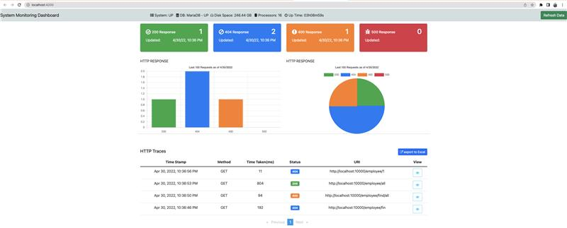

## Dashboard Actuator

### Overview

- [Roadmap](#roadmap)
  - [Easy](#easy)
  - [Middle](#middle)
  - [Hard](#hard)

- [Angular](#angular)
  - [Development server](#development-server)
  - [Code scaffolding](#code-scaffolding)
  - [Build](#build)
  - [Running unit tests](#running-unit-tests)
  - [Running end-to-end tests](#running-end-to-end-tests)
  - [Further help](#further-help)

### Roadmap

#### Easy
- [x] Realize backend logic
- [x] Make a template with [front](docs/app.jpg)
- [ ] Implement unit tests
- [ ] Implement CheckStyle

#### Middle
- [ ] GitHub Issue Board
- [ ] Realize GitHub Action flow (CI)
- [ ] Implement Redux (RxJS) for state management

#### Hard
- [ ] Realize component with Login page
- [ ] JWT Token 

# Angular

This project was generated with [Angular CLI](https://github.com/angular/angular-cli) version 13.3.4.

## Development server

Run `ng serve` for a dev server. Navigate to `http://localhost:4200/`. The application will automatically reload if you change any of the source files.

## Code scaffolding

Run `ng generate component component-name` to generate a new component. You can also use `ng generate directive|pipe|service|class|guard|interface|enum|module`.

## Build

Run `ng build` to build the project. The build artifacts will be stored in the `dist/` directory.

## Running unit tests

Run `ng test` to execute the unit tests via [Karma](https://karma-runner.github.io).

## Running end-to-end tests

Run `ng e2e` to execute the end-to-end tests via a platform of your choice. To use this command, you need to first add a package that implements end-to-end testing capabilities.

## Further help

To get more help on the Angular CLI use `ng help` or go check out the [Angular CLI Overview and Command Reference](https://angular.io/cli) page.
